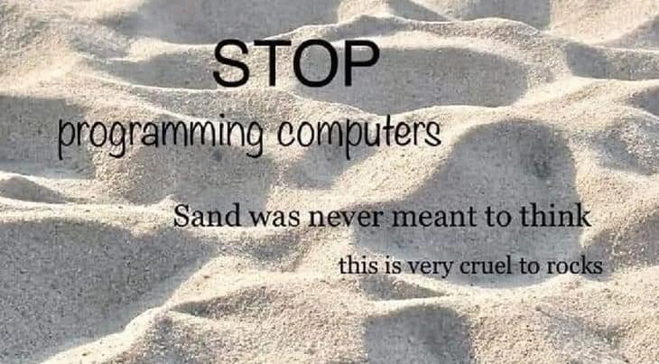

<h1 align="center">0x6b336e746434690d0a</h1>


Bienvenido al GitHub de **k3ntd4i**, Estudiante de Ingeniería de Sistemas y Computación, apasionado de la seguridad informática. Mente inquieta en búsqueda de la expresión artística definitiva; _los ceros y unos más severos._

> Hacking y ganas de estallar el teclado.

## Habilidades

```text
k3nt@github:~$ ./skills.sh
[+] Amplia experiencia:
    - [Lenguajes] C++
    - [Herramientas] VS Code
[+] Familiarizado con:
    - [Lenguajes] Python, Java
    - [Librerías] SFML (C++)
[+] Aprendiendo o utilizados:
    - [Lenguajes] Assembly, PowerShell, Bash, C, R, SQL, Arduino, HTML, CSS, JavaScript, Makefile
    - [Herramientas] Vim
[+] Otros:
    - Oracle VirtualBox
    - LaTeX
    - Markdown
    - GeoGebra
```

## Formación

```text
k3nt@github:~$ ./learning.sh
[+] Certificaciones:
    - [Cisco] CCNA
[+] Cursos:
    - [Q-mission] Respuesta ante Incidentes Cibernéticos y Análisis de Malware
    - [Platzi] Redes Informáticas de Internet
    - [Platzi] Introducción a la Ingeniería Social: Técnicas, Ataques y Pretexting
    - [SENA] Redes y Seguridad
[+] Autónomamente, a la deriva del vasto abismo de la información
```

---

<div align="center">
    
    <p>🎨 🖌️ ✏️ ✒️ 🖼️ 📷 📽️ 📹 📼 🎃 ➗ 👘 🎹 🎛️ 🎧 🧊 🎮 💾 💽 🚲 🛸 🐧</p>
</div>

---

<div align="center">
    <a href="https://www.youtube.com/watch?v=91oYUrY6DBs" target="_blank" rel="noopener noreferrer">
        
    </a>
</div>
